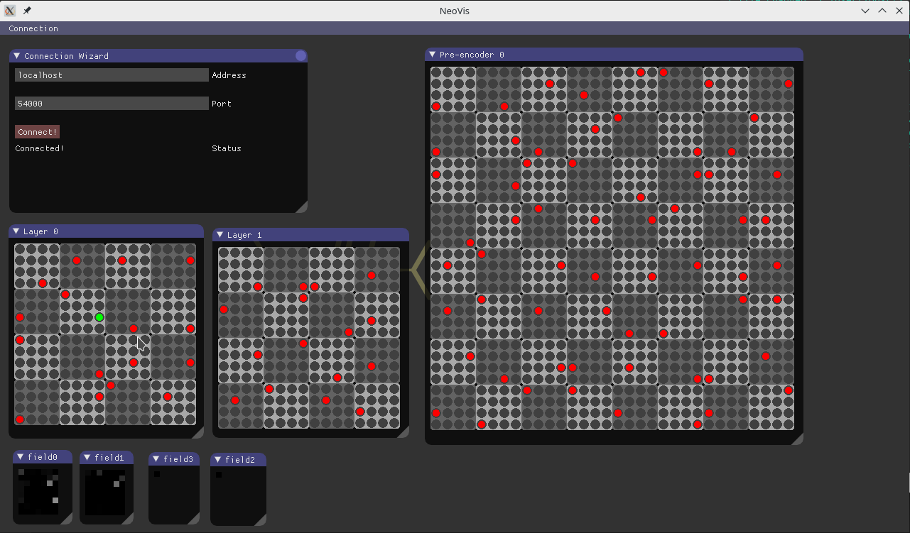

<!---
  NeoVis
  Copyright(c) 2017-2019 Ogma Intelligent Systems Corp. All rights reserved.

  This copy of NeoVis is licensed to you under the terms described
  in the NEOVIS_LICENSE.md file included in this distribution.
--->

# NeoVis

[](https://gitter.im/ogmaneo/Lobby)

**New! Now works with [OgmaNeo2](https://github.com/ogmacorp/OgmaNeo2) (through [PyOgmaNeo2](https://github.com/ogmacorp/PyOgmaNeo2.git))!**

NeoVis is a visualizer for [OgmaNeo2](https://github.com/ogmacorp/OgmaNeo2) (using the Python interface, [PyOgmaNeo2](https://github.com/ogmacorp/PyOgmaNeo2.git)) hierarchies, built using 'dear imgui' (AKA [ImGui](https://github.com/ocornut/imgui)) and the Simple and Fast Multimedia Library (AKA [SFML](https://www.sfml-dev.org/)).



## Overview

NeoVis is an application that allows one to visualize in real-time the contents of an OgmaNeo2 hierarchy. It uses sockets to communicate with the client program. It can be connected and disconnected seamlessly, provided the client code contains the appropriate visualization update function.

## Building

The following commands can be used to build the NeoVis library:

> cd NeoVis  
> mkdir build; cd build  
> cmake ..  
> make  

The `cmake` command can be passed a `CMAKE_INSTALL_PREFIX` to determine where to install the visualization executable.  

On Windows it is recommended to use `cmake-gui` to define which generator to use and specify optional build parameters.

### CMake

Version 3.1, and upwards, of [CMake](https://cmake.org/) is the required version to use when building the library.

## Client code

Include visadapter/VisAdapter.py into your Python code by whichever method you prefer. Then:

```python
from visadapter.VisAdapter import VisAdapter

# ...

cs = pyogmaneo.PyComputeSystem(...)

# ...

h = pyogmaneo.PyHierarchy(...)

# ...

enc = pyogmaneo.PyImageEncoder(...)

# ...

# Initialize the VisAdapter
v = VisAdapter()

v.create(54000) # Port

# ...

# In simulation loop:
v.update(cs, h, [ enc ]) # Visualize hierarchy h and pre-encoder enc

```

## Host operation

Once NeoVis is started, use the `Connection` button and `Connection Wizard` dialog box to open a connection to your hierarchy. Simply specify the address (localhost, if on same machine) of the client, and make sure that both applications are using the same port (default 54000). Once `Connect!` button has been pressed, and the status switches to "Connected", you should see several windows appear.

Each layer has windows for its hidden layer CSDR (Sparse Distributed Representation) and feed-forward weight matrices.

The CSDRs are organized into a "grid of grids", where each sub-grid represents a 1D column (wrapped into 2D for ease of visualization). You can right-click on any cell to show the corresponding feed-forward weight matrices.
You can also hover over the weight matrix display and use the scroll wheel to cycle through different Z-levels of the weight matrices. If there are 3 or 6 Z-levels, these will be visualized as either RGB or two RGB (side by side) images, respectively.

At the moment, CSDR and feed-forward weight matrix visualizations are the only features of NeoVis. Despite this, we found it quite handy for debugging our programs. If your application isn't functioning properly, it may be a good idea to pear into the network with NeoVis!

## Note

Please note that the visualizer only works with simulation-like environments. It assumes that the client is running in real-time, and it streams whatever the latest state is for visualization. This makes is particularly handy for visualizing the OgmaNeo2 hierarchy during reinforcement-learning-like tasks and other realtime applications.

## Contributions

Refer to the [CONTRIBUTING.md](https://github.com/ogmacorp/NeoVis/blob/master/CONTRIBUTING.md) file for information on making contributions to NeoVis.

## License and Copyright

<a rel="license" href="http://creativecommons.org/licenses/by-nc-sa/4.0/"></a><br />The work in this repository is licensed under the <a rel="license" href="http://creativecommons.org/licenses/by-nc-sa/4.0/">Creative Commons Attribution-NonCommercial-ShareAlike 4.0 International License</a>. See the  [NEOVIS_LICENSE.md](https://github.com/ogmacorp/NeoVis/blob/master/NEOVIS_LICENSE.md) and [LICENSE.md](https://github.com/ogmacorp/NeoVis/blob/master/LICENSE.md) file for further information.

Dear ImGui is licensed under the MIT License.  
SFML license https://github.com/SFML/SFML/blob/master/license.md

Contact Ogma via licenses@ogmacorp.com to discuss commercial use and licensing options.

NeoVis Copyright (c) 2017-2019 [Ogma Intelligent Systems Corp](https://ogmacorp.com). All rights reserved.
